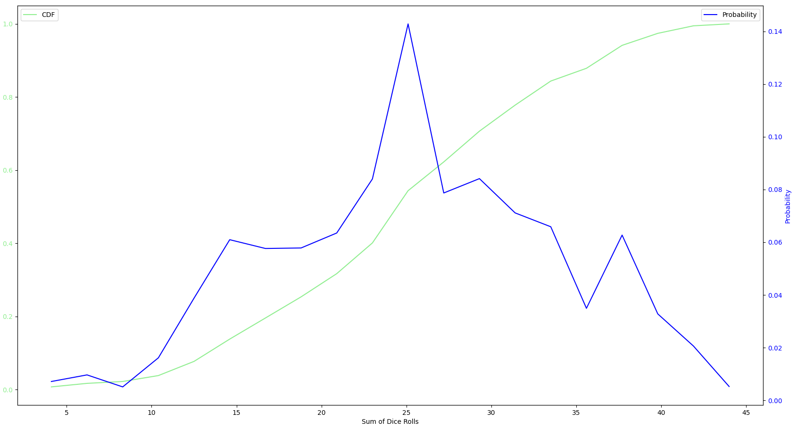

# Shut-The-Box - Math Analysis

## ABOUT THE GAME
**Aim of the Game:**  
The goal of "Shut the Box" is to flip down all numbers from 1 to 12.

**Game Materials:**  
- A "Shut the Box" game board with numbers from 1 to 12.
- Two dice with faces numbered 1 to 6.

**Game Rules:**  
1. At the start of the game, all numbers on the game board are flipped up.
2. A player rolls both dice and adds the numbers rolled.
3. The player then selects any combinations of flipped down numbers on the game board whose sum equals the sum of the dice rolls (**FOR THIS SIMULATION MAX OF 2**).
4. If a player cannot find any combinations of flipped down numbers that equal the sum of the dice rolls, their turn ends.
5. The player repeats steps 2-4 until all numbers on the game board have been flipped down or no more moves are possible.
6. If all numbers on the game board have been flipped down, the player wins. Otherwise, the sum of the remaining flipped up numbers is counted as their score.

7. **Winner:**  
The player with the lowest score wins. In a variation of the game, players can also attempt to improve their scores from round to round.

## Strategy Comparison using Simulations:
I am interested in comparing various strategies for playing "Shut the Box" using simulations.

**Objective:**  
The objective of the simulation is to evaluate the effectiveness of different strategies in achieving the lowest score possible in "Shut the Box".

**Strategies:**  
I will implement and compare several strategies, such as:
1. Random selection of numbers to flip down.
2. Greedy strategy: Always choosing the combination that flips down the highest possible number of digits.
3. Optimized algorithms: Implementing more sophisticated algorithms based on game theory or dynamic programming to determine the best moves.

**Simulation Setup:**  
- Simulate multiple games for each strategy.
- Record the scores achieved by each strategy in each game.
- Analyze the distribution of scores and compare the performance of different strategies.

## Results

#### Random Selection** - Player flips down a random possible combination

#### Highest Value (greedy)** - Player flips down a combination with the highest number possible(e.g 9 is prefered over 4/5)

#### Lowest Value ** - Player flips down a combination with the lowest number possible (e.g 1/2 is prefered over 3)

#### Optimzied Solution** - Finding a better option than "Highest Value"
Coming Soon

